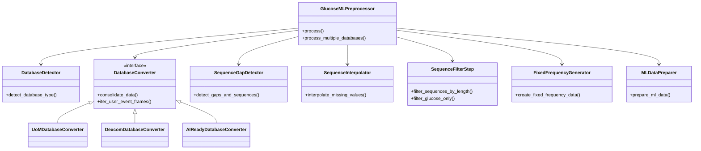

# Glucose Data Preprocessing for Machine Learning

A professional pipeline for normalizing and preparing continuous glucose monitoring (CGM) data for time-series machine learning models.

## 🏛️ System Architecture

The system is designed as a modular pipeline with specialized components for each transformation stage.



## 🛠️ Processing Pipeline

The preprocessor executes the following steps in sequence:

1.  **Consolidation**: Normalizes various database formats (CSV, JSON, ZIP) into a standardized multi-user event stream.
2.  **Gap Detection**: Identifies time gaps exceeding the threshold and splits data into contiguous sequences.
3.  **Smart Interpolation**: Performs linear interpolation on "continuous" fields for small gaps while preserving "occasional" events.
4.  **Length Filtering**: Discards sequences that do not meet the minimum required length for ML training.
5.  **Fixed-Frequency Generation**: Resamples sequences to a consistent time interval (e.g., 5 minutes) using averaging for continuous fields and bucket-shifting for events.
6.  **ML Preparation**: Applies final schema constraints and exports the ML-ready dataset.

## 📂 Project Structure

- `glucose_cli.py`: Primary entry point for the application.
- `glucose_ml_preprocessor.py`: Orchestration class for the pipeline.
- `formats/`: Database-specific converters and [Schema Definitions](docs/schemas.md).
- `processing/`: Component logic for gap detection, interpolation, and resampling.
- `docs/`: Detailed documentation for [Configuration](docs/config.md), [CLI Commands](docs/cli.md), and [Schemas](docs/schemas.md).

## 📊 Supported Datasets

- **UoM (University of Manchester)**: Multi-modality T1D dataset.
- **AI-READY**: Comprehensive health dataset in zip format.
- **Dexcom G6**: Standardized export format from Dexcom receivers.
- **FreeStyle Libre 3**: Abbott's CGM data format.

## 🚀 Quick Start

```bash
# Setup dependencies
uv sync

# Run with default settings
uv run glucose_cli.py data/uom_small -o ml_ready.csv

# Combine multiple databases
uv run glucose_cli.py data/uom_small data/dexcom_user1 -o combined.csv
```

For advanced configuration, refer to the [Pipeline Configuration](docs/config.md) and [CLI Documentation](docs/cli.md).
